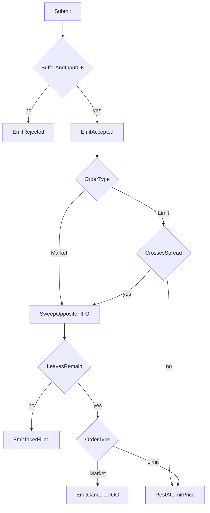

# Ultra-Low Latency L2 Order Book & Matching Engine

상태: Draft  
언어: Go (표준 라이브러리만 사용)  
범위: 인메모리 Price-Time Priority 매칭 코어, 벤치마크, 결정론 검증

이 문서는 구현 계약이다. Phase 1부터 이 문서만 보고 엔진을 작성할 수 있어야 한다. 외부 라이브러리, 웹 서버, 데이터베이스는 엔진 범위에 넣지 않는다.

---

## 1. Overview & Goals

### 1.1 목적

거래소 호가창의 핵심인 **L2 오더북**과 **매칭 엔진**을 순수 인메모리로 구현한다. 체결 우선순위는 **Price-Time Priority (FIFO)** 다.

- 더 좋은 가격이 먼저 체결된다. 매수는 높은 가격이 우선이고, 매도는 낮은 가격이 우선이다.
- 같은 가격에서는 호가에 먼저 안착한 주문이 먼저 체결된다.
- 체결 가격은 항상 **메이커(기존 호가) 가격**이다.

이 저장소는 웹 백엔드가 아니다. 나노초 단위 지연과 할당 제거를 익히기 위한 코어 엔지니어링 프로젝트다.

### 1.2 엔지니어링 목표

| 목표 | 기준 |
| --- | --- |
| Throughput | 단일 스레드에서 사전 생성된 100만 건 스크립트를 처리하고, 초당 처리 건수를 보고한다. |
| 지연 | 평균은 `go test -bench`의 ns/op으로 본다. P99는 엔진 내부의 고정 버킷 히스토그램으로 측정한다. |
| 할당 | Phase 4 핫패스 목표는 `0 allocs/op`이다. |
| 결정론 | 같은 입력 시퀀스는 같은 이벤트 시퀀스를 만든다. |

핫패스는 주문 한 건의 검증, 교차 체결, 잔량 안착, 취소, 수량 감소 정정이다. 이 경로에서 힙 할당, 락, 채널 송수신, `interface` 디스패치가 발생하면 Phase 4 완료 조건을 만족하지 못한다.

### 1.3 설계 한 줄 요약

단일 스레드 매칭 코어가 침습적 레드블랙 트리(가격)와 이중 연결 리스트(시간)로 호가를 유지하고, 배열 기반 FreeList와 사전 할당 인덱스로 체결 결과를 호출자 버퍼에 기록한다.

---

## 2. Design Principles

1. **단일 스레드 코어.** `OrderBook`의 변경은 한 고루틴만 수행한다. 뮤텍스를 엔진 안에 두지 않는다. 동시 생산자가 필요하면 엔진 밖에서 직렬화한다.
2. **정수 틱.** 가격과 수량은 `int64`다. 코어는 부동소수점을 비교하거나 저장하지 않는다. 틱 크기 변환은 호출자 책임이다.
3. **호출자 시계.** 타임스탬프는 `int64` 나노초이며 호출자가 넘긴다. 엔진은 `time.Now`를 호출하지 않는다. FIFO는 타임스탬프 정렬이 아니라 **성공적인 안착 순서**다. 같은 타임스탬프가 여러 주문에 있어도 큐 순서는 호출 순서를 따른다.
4. **침습적 자료구조.** 리스트 노드와 트리 노드를 따로 할당하지 않는다. 링크 필드는 `Order`와 `LimitLevel` 안에 있다.
5. **핫패스 할당 금지.** `make`, 문자열 결합, `fmt`, 내장 `map`의 성장, `append`로 인한 슬라이스 성장은 체결 루프 밖에 둔다. 버퍼가 부족하면 상태를 바꾸기 전에 에러를 반환한다.
6. **동종 이벤트.** 체결·주문 상태는 하나의 `Event` 값 슬라이스로 내보낸다. 인터페이스 슬라이스를 만들지 않는다.
7. **표준 라이브러리만.** 모듈 의존성은 Go 툴체인뿐이다.

---

## 3. Data Structures

### 3.1 공통 열거

```go
type Side uint8

const (
    SideBuy  Side = 1
    SideSell Side = 2
)

type OrderType uint8

const (
    TypeLimit  OrderType = 1
    TypeMarket OrderType = 2
)
```

`OrderID` 0은 비어 있는 인덱스 슬롯을 뜻하므로 유효한 주문 번호가 아니다. 주문 번호는 1부터 시작한다.

### 3.2 Order

```go
type Order struct {
    ID        uint64
    Side      uint8
    Type      uint8
    Price     int64
    Qty       int64
    Leaves    int64
    Timestamp int64
    Prev      *Order
    Next      *Order
    Level     *LimitLevel
    Slot      uint32
}
```

| 필드 | 의미 |
| --- | --- |
| `ID` | 호출자가 부여한 주문 번호. 북 안에서 유일하다. |
| `Side` | `SideBuy` 또는 `SideSell`. |
| `Type` | `TypeLimit` 또는 `TypeMarket`. 안착한 주문은 항상 지정가다. |
| `Price` | 지정가 틱. 시장가에서는 0이며 체결 가격으로 쓰이지 않는다. |
| `Qty` | 최초 수량. 정정으로 바뀌지 않는 원주문 수량이다. |
| `Leaves` | 미체결 잔량. 호가 수량과 체결 계산은 이 값을 쓴다. |
| `Timestamp` | 호출자가 준 나노초. 체결 이벤트에 그대로 복사된다. |
| `Prev`, `Next` | 같은 `LimitLevel` 안의 FIFO 링크. |
| `Level` | 이 주문이 속한 가격 레벨. 안착 전에는 nil이다. |
| `Slot` | `OrderPool` 배열 인덱스. 풀에 반환할 때 사용한다. |

주문 한 건은 최대 한 레벨의 리스트에만 들어간다. `Prev`/`Next`가 가리키는 주문은 같은 `Level`을 가진다.

### 3.3 LimitLevel

한 가격의 총잔량과 FIFO 큐, 그리고 가격 트리의 링크를 한 구조체가 가진다.

```go
type LimitLevel struct {
    Price    int64
    TotalQty int64
    Head     *Order
    Tail     *Order
    Count    int32
    Left     *LimitLevel
    Right    *LimitLevel
    Parent   *LimitLevel
    Color    uint8 // 0 = black, 1 = red
    Slot     uint32
}
```

- `TotalQty`는 그 레벨에 연결된 모든 주문의 `Leaves` 합과 같다.
- `Count`는 연결된 주문 수와 같다.
- `Head`가 그 가격의 최우선 주문이고, `Tail`이 가장 늦게 안착한 주문이다.
- 큐가 비면 `Head == nil`, `Tail == nil`, `Count == 0`, `TotalQty == 0`이고, 레벨은 트리에서 제거되어 풀로 돌아간다.

리스트 연산은 모두 O(1)이다.

- `PushBack`: 꼬리에 붙인다. 빈 큐면 head와 tail이 그 주문이다.
- `Unlink`: `Prev`/`Next`를 다시 잇고, head/tail을 필요하면 갱신한다. 가운데 주문 취소도 O(1)이다.
- `PopFront`: 체결로 메이커가 소진되면 head를 떼어 낸다.

### 3.4 가격 트리

매수 트리 하나, 매도 트리 하나를 둔다. 둘 다 가격 오름차순 레드블랙 트리다.

- 노드 키는 `LimitLevel.Price`다. 한 트리 안에서 가격은 유일하다.
- 최우선 매수(`BestBid`)는 매수 트리의 최댓값(오른쪽 끝)이다.
- 최우선 매도(`BestAsk`)는 매도 트리의 최솟값(왼쪽 끝)이다.
- `BestBid`와 `BestAsk` 포인터를 `OrderBook`에 캐시한다.
- 삽입과 삭제는 O(log N)이다. N은 해당 사이드의 가격 레벨 수다.
- 최우선 레벨이 그대로면 캐시 갱신은 O(1)이다. 최우선 레벨이 삭제되면 후계 최우선 노드를 O(log N)에 다시 찾는다.
- 회전은 포인터만 바꾼다. 회전 중에 할당하지 않는다.

레드블랙 불변식은 디버그 검증에서 확인한다. 구현은 표준 CLRS 규칙을 따른다. 색은 `uint8` 한 필드다.

### 3.5 OrderBook

```go
type OrderBook struct {
    Bids         *LimitLevel
    Asks         *LimitLevel
    BestBid      *LimitLevel
    BestAsk      *LimitLevel
    Orders       OrderIndex
    OrderPool    OrderPool
    LevelPool    LevelPool
    NextTradeID  uint64
    RestingCount int32
}
```

| 필드 | 역할 |
| --- | --- |
| `Bids`, `Asks` | 각 사이드 레드블랙 트리의 루트. |
| `BestBid`, `BestAsk` | 캐시된 최우선 레벨. 호가가 없으면 nil. |
| `Orders` | `OrderID → 풀 슬롯` 인덱스. 안착한 주문만 들어 있다. |
| `OrderPool`, `LevelPool` | 배열 기반 FreeList. |
| `NextTradeID` | 다음 체결 번호. 초기값은 1이고 체결마다 1 증가한다. |
| `RestingCount` | 현재 호가에 살아있는 주문 수. 이벤트 버퍼 사전 검사에 쓴다. |

`Depth` 조회는 최우선 노드에서 매수는 선행자(더 낮은 가격), 매도는 후속자(더 높은 가격) 순으로 최대 `n`개 레벨을 호출자 버퍼에 채운다. 조회는 북을 변경하지 않는다.

### 3.6 복잡도

| 연산 | 복잡도 | 비고 |
| --- | --- | --- |
| 최우선 호가 조회 | O(1) | 캐시된 포인터 |
| 지정가 안착 | O(log N) | 가격 레벨 탐색·삽입. 같은 가격이 있으면 리스트 push는 O(1) |
| 최우선 레벨과의 체결 1회 | O(1) | head와 수량만 갱신 |
| 취소 | O(1) + 조건부 O(log N) | 인덱스 조회와 unlink는 O(1). 레벨의 마지막 주문이면 트리 삭제가 O(log N) |
| 수량 감소 정정 | O(1) | 시간 우선순위 유지 |
| 가격 변경·수량 증가 정정 | 취소 + 안착 | 우선순위를 잃고 새 타임스탬프를 받는다 |
| 깊이 `n` 조회 | O(n) | 호출자 버퍼에 기록 |

### 3.7 캐시라인

Phase 1–3에서는 패딩 없이 위 필드 순서만 유지한다. 자주 같이 읽는 값(`Price`, `Leaves`, `Prev`, `Next`, `Head`, `Tail`, `TotalQty`)이 구조체 앞쪽에 모이도록 필드를 배치한다.

Phase 4에서 64바이트 정렬을 검토한다. 단일 스레드 코어에서는 무조건적인 패딩이 캐시를 더 많이 쓰므로, 다음 경우에만 패딩을 넣는다.

- `Order` 또는 `LimitLevel`의 핫 필드가 두 캐시라인으로 나뉘어 체결 루프가 매번 두 라인을 건드리는 경우, 핫 필드를 한 라인에 모은다.
- 나중에 엔진 밖 스레드가 이벤트 링의 쓰기 인덱스와 엔진 상태를 같은 라인에서 공유하게 되는 경우, 그 인덱스만 분리한다.

패딩은 `benchmem`과 히스토그램으로 이득이 확인될 때만 남긴다.

---

## 4. Memory Strategy

### 4.1 1차 전략: 배열 기반 FreeList

`sync.Pool`은 GC가 풀을 비울 수 있어 지연이 들쭉날쭉하다. 비교 벤치마크의 대조군으로만 남기고, 엔진의 기본 풀은 배열 FreeList다.

초기화 때 `Order` 배열과 `LimitLevel` 배열을 한 번 할당한다. 자유 슬롯은 `uint32` 스택이다. `Get`은 스택에서 인덱스를 꺼내고 그 슬롯의 포인터를 돌려준다. `Put`은 필드를 영점화하고 인덱스를 스택에 되돌린다. 둘 다 힙에 새로 할당하지 않는다.

```go
type OrderPool struct {
    slots []Order
    free  []uint32
    top   int32
}

func NewOrderPool(n int) *OrderPool
func (p *OrderPool) Get() (*Order, bool)
func (p *OrderPool) Put(o *Order)
```

`LevelPool`도 같은 모양이다. `Get`의 `bool`이 false이면 풀이 비었다. 핫패스에서 `make`로 늘리지 않는다.

풀 용량은 프로세스 수명 동안 고정이다. 벤치마크와 테스트는 스크립트에 필요한 최대 안착 주문 수, 최대 가격 레벨 수 이상으로 잡는다.

`Order.Slot`과 `LimitLevel.Slot`은 `Get` 시점에 기록한다. `Put`은 포인터에서 슬롯 번호를 읽어 반환한다.

### 4.2 풀이 비었을 때

- 주문을 안착시켜야 하는데 `OrderPool`이 비어 있으면, 이미 발생한 체결은 유지하고 남은 수량은 `ReasonPoolExhausted`로 취소한다.
- 새 가격 레벨이 필요한데 `LevelPool`이 비어 있으면 같은 규칙을 따른다. 기존 가격 레벨에 붙는 경우는 레벨 할당이 필요 없다.
- 체결만으로 끝나는 주문(전량 체결, 시장가)은 안착 슬롯을 받지 않는다.
- 풀 고갈은 테스트에서 재현 가능해야 한다. 벤치마크 스크립트는 고갈이 나지 않는 용량을 사용한다.

### 4.3 OrderID 인덱스

취소와 정정의 조회는 평균 O(1)이다.

**Phase 1–3 기준선.** 구현을 빨리 검증하기 위해 `map[uint64]*Order`를 허용한다. 이 맵은 삽입 때 할당할 수 있으므로 Phase 4 목표 수치가 아니다. 벤치마크 표에는 `baseline-map`이라는 이름을 붙인다.

**Phase 4 목표.** 오픈 어드레싱 테이블로 교체한다.

```go
type OrderIndex struct {
    keys  []uint64
    slots []uint32
    used  int32
    mask  uint32
}

func (x *OrderIndex) Lookup(id uint64) (*Order, bool)
func (x *OrderIndex) Insert(id uint64, slot uint32) bool
func (x *OrderIndex) Delete(id uint64)
```

- 테이블 길이는 2의 거듭제곱이고 초기화 때 한 번 할당한다.
- 키 0은 빈 칸이다. 따라서 주문 번호 0은 거부한다.
- 삭제는 톰스톤을 남기거나, 선형 탐침을 끊지 않는 방식(후방 이동)으로 처리한다. 구현은 하나를 고르고 테스트로 삭제 후 조회·재삽입을 고정한다.
- 적재율이 0.7을 넘기면 `Insert`는 false를 반환하고 재해싱하지 않는다. 재해싱은 할당을 일으키므로 핫패스 밖에만 둔다. 테이블이 거절하면 주문 잔량은 `ReasonPoolExhausted`와 같은 방식으로 취소한다.
- 해시 함수는 곱셈 해시처럼 할당이 없는 정수 연산을 쓴다.
- 벤치마크가 1부터 연속된 ID만 쓰면, 동일 패키지 안에 직접 슬롯 테이블(`[]uint32`, 길이 = 최대 ID + 1)을 대체 구현으로 둘 수 있다. 공개 동작은 `Lookup`/`Insert`/`Delete`와 같다.

인덱스에는 **안착한 주문만** 넣는다. 전량 체결된 테이커, 시장가, 거부된 주문은 인덱스에 남지 않는다.

### 4.4 이벤트 버퍼

매칭 함수는 이벤트 슬라이스를 새로 만들지 않는다. 호출자가 준 `dst`의 남은 용량에 기록하고, 같은 슬라이스 헤더를 반환한다.

```go
func MaxEventsFor(resting int32) int {
    return int(2*resting + 4)
}
```

`Submit`/`Cancel`/`Amend`는 상태를 바꾸기 전에 `cap(dst)-len(dst) >= MaxEventsFor(book.RestingCount)`를 확인한다. 용량이 부족하면 `ErrBufferFull`을 반환하고 북은 그대로다.

한 주문이 낼 수 있는 이벤트는 메이커 체결마다 최대 2개(트레이드 + 메이커 상태)와 테이커 상태 몇 개다. `2*resting+4`는 그 상한이다. 벤치마크는 op당 이 상한 또는 스크립트 전체에 대한 합으로 `dst`를 미리 잡는다. 루프 안에서 `dst`의 `len`만 되감고 `cap`은 유지한다.

---

## 5. Matching Logic

### 5.1 이벤트

출력은 이벤트 하나의 배열이다. 트레이드도 같은 구조체다.

```go
type EventKind uint8

const (
    EventAccepted        EventKind = 1
    EventPartiallyFilled EventKind = 2
    EventFilled          EventKind = 3
    EventCanceled        EventKind = 4
    EventRejected        EventKind = 5
    EventAmended         EventKind = 6
    EventTrade           EventKind = 7
)

type Reason uint8

const (
    ReasonNone           Reason = 0
    ReasonBadQty         Reason = 1
    ReasonBadPrice       Reason = 2
    ReasonDuplicateID    Reason = 3
    ReasonNotFound       Reason = 4
    ReasonPoolExhausted  Reason = 5
	ReasonIOCRemainder   Reason = 6
	ReasonBufferFull     Reason = 7
	ReasonBadType        Reason = 8
)

type Event struct {
    Kind      EventKind
    Reason    Reason
    OrderID   uint64
    MatchID   uint64
    TradeID   uint64
    Price     int64
    Qty       int64
    Leaves    int64
    Timestamp int64
}
```

| Kind | 필드 의미 |
| --- | --- |
| `EventTrade` | `OrderID` = 테이커, `MatchID` = 메이커, `Price` = 메이커 가격, `Qty` = 이번 체결 수량, `TradeID` = `NextTradeID` |
| `EventAccepted` | 검증을 통과해 엔진에 들어왔다. `Leaves`는 진입 시점 잔량(`Qty`) |
| `EventPartiallyFilled` | `Qty`는 이번 체결 수량, `Leaves`는 체결 후 잔량 |
| `EventFilled` | `Leaves == 0`. `Qty`는 이번 체결 수량 |
| `EventCanceled` | `Leaves`는 취소되는 잔량, `Qty`는 그 잔량과 같다 |
| `EventRejected` | 북이 바뀌기 전에 거절. `Reason`이 원인을 담는다 |
| `EventAmended` | 수량 감소. `Qty`는 감소 후 `Leaves`, `Price`는 유지된 가격 |

### 5.2 생애주기



### 5.3 입력 검증

아래이면 `EventRejected`만 내고 끝난다. 풀과 트리는 그대로다.

- `Qty <= 0` → `ReasonBadQty`
- 지정가이고 `Price <= 0` → `ReasonBadPrice`
- `ID == 0` 또는 인덱스에 같은 ID가 이미 있음 → `ReasonDuplicateID`
- `Side`가 매수·매도가 아니거나 `Type`이 지정가·시장가가 아님 → `ReasonBadType`

버퍼 부족은 거절 이벤트를 쓸 자리가 없을 수 있으므로 이벤트를 추가하지 않고 `ErrBufferFull`만 반환한다.

### 5.4 지정가 진입과 교차

검증을 통과하면 `EventAccepted`를 먼저 기록한다. 그다음 교차 여부를 본다.

- 매수 지정가가 교차한다: `BestAsk != nil && BestAsk.Price <= order.Price`
- 매도 지정가가 교차한다: `BestBid != nil && BestBid.Price >= order.Price`

교차하지 않으면 5.6의 안착으로 간다. 교차하면 상대 최우선 레벨의 `Head`부터 FIFO로 체결한다.

한 체결 단계:

1. `maker = level.Head`
2. `fill = min(taker.Leaves, maker.Leaves)`
3. 둘의 `Leaves`에서 `fill`을 뺀다. 레벨 `TotalQty`에서 `fill`을 뺀다.
4. `TradeID = NextTradeID`을 기록하고 `NextTradeID`를 1 증가시킨다.
5. `EventTrade`를 쓴다. 가격은 `maker.Price`다.
6. 메이커 `Leaves == 0`이면 메이커를 unlink하고, 인덱스를 지우고, 풀에 반환하고, `RestingCount`를 줄이고, `EventFilled`를 쓴다. 레벨 `Count`가 0이면 트리에서 레벨을 제거하고 `BestBid`/`BestAsk`를 갱신한 뒤 레벨을 풀에 반환한다.
7. 메이커 잔량이 남으면 메이커는 큐의 head인 채로 두고 `EventPartiallyFilled`를 쓴다.
8. 테이커 잔량이 0이면 테이커 `EventFilled`를 쓰고 루프를 끝낸다. 테이커는 인덱스와 풀 슬롯을 받지 않는다.
9. 테이커 잔량이 남고 아직 교차하는 다음 레벨이 있으면 `Head`부터 반복한다.

지정가 테이커는 자신의 가격을 넘어 체결하지 않는다. 매수 테이커는 `BestAsk.Price <= taker.Price`인 동안만, 매도 테이커는 `BestBid.Price >= taker.Price`인 동안만 전진한다.

여러 레벨에 걸치면 항상 더 좋은 메이커 가격을 먼저 소진한다. 같은 레벨에서는 head부터다.

### 5.5 부분 체결과 전량 체결

- 메이커가 일부만 깎이면 그 주문의 시간 우선순위는 유지된다. head가 잔량을 가진 채 남는다.
- 메이커가 전량 체결되면 그 가격의 다음 주문이 새 head가 된다.
- 테이커가 전량 체결되면 호가에 남지 않는다.
- 테이커가 일부만 체결되고 지정가 잔량이 남으면 5.6으로 안착하고, 테이커에게 `EventPartiallyFilled`를 한 번 쓴다. `Qty`는 이번 주문에서 누적 체결된 수량이 아니라 **마지막으로 나눈 체결 수량**이며, 누적량은 `Qty - Leaves`로 재구성한다. 각 체결은 이미 `EventTrade`로 남아 있다.
- 부분 체결 이벤트를 트레이드마다 테이커에게도 쓰면 이벤트 수가 상한을 넘길 수 있다. 테이커의 `EventPartiallyFilled`는 **안착 직전 1회**만 쓴다. 메이커는 체결마다 상태 이벤트를 쓴다.

예시. 빈 북에서 다음 순서로 넣으면 이벤트는 결정적이다.

| 순서 | 입력 | 결과 호가 |
| --- | --- | --- |
| 1 | Buy Limit ID=1 Price=100 Qty=5 ts=1 | Bid 100 × 5 (주문 1) |
| 2 | Buy Limit ID=2 Price=100 Qty=3 ts=2 | Bid 100 × 8, 큐는 1 → 2 |
| 3 | Sell Limit ID=3 Price=100 Qty=6 ts=3 | Bid 100 × 2 (주문 2만 잔량 2) |
| 4 | Sell Market ID=4 Qty=5 ts=4 | 북 비움. 주문 4의 잔량 3은 IOC 취소 |

주문 3의 체결:

- Trade 1: taker 3, maker 1, price 100, qty 5. 주문 1 `Filled`.
- Trade 2: taker 3, maker 2, price 100, qty 1. 주문 2 `PartiallyFilled`, leaves 2.
- 주문 3 `Filled`.

주문 4의 체결:

- Trade 3: taker 4, maker 2, price 100, qty 2. 주문 2 `Filled`.
- 주문 4 `Canceled`, reason `ReasonIOCRemainder`, leaves 3.

이 시퀀스는 `test/fixtures`의 첫 골든 케이스로 쓴다.

### 5.6 잔량 안착

지정가 잔량이 0보다 크면 그 사이드 트리에 넣는다.

1. 같은 가격 레벨이 있으면 그 레벨의 tail에 주문을 붙인다.
2. 없으면 `LevelPool`에서 레벨을 받아 가격을 세팅하고 트리에 삽입한 뒤, 그 레벨의 첫 주문으로 붙인다.
3. 주문 필드는 풀 슬롯에 복사한다. 호출자가 넘긴 메모리는 엔진이 보관하지 않는다.
4. 인덱스가 슬롯을 거절하거나 풀이 비면, 이미 기록된 체결은 유지하고 잔량을 `ReasonPoolExhausted`로 취소한다.
5. 성공하면 `RestingCount`를 1 늘리고 `TotalQty`에 `Leaves`를 더한다.
6. 새 가격이 최우선이면 `BestBid` 또는 `BestAsk`를 그 레벨로 바꾼다.

시장가 주문은 이 단계로 오지 않는다.

### 5.7 취소

```text
Cancel(id):
  if buffer too small: return ErrBufferFull, book unchanged
  order = index.Lookup(id)
  if not found: return ErrNotFound, book unchanged
  unlink order from order.Level
  level.TotalQty -= order.Leaves
  level.Count -= 1
  if level.Count == 0:
      delete level from its tree
      refresh BestBid or BestAsk
      levelPool.Put(level)
  index.Delete(id)
  restingCount -= 1
  emit EventCanceled, reason ReasonNone, qty = leaves
  orderPool.Put(order)
```

없는 ID는 상태를 바꾸지 않고 `ErrNotFound`를 반환한다. 이미 전량 체결되어 인덱스에 없는 주문도 같은 경로다.

취소는 큐의 위치와 무관하게 unlink가 O(1)이다. 트리 비용은 그 가격의 마지막 주문을 거둘 때만 발생한다.

### 5.8 정정

```go
func (b *OrderBook) Amend(id uint64, newPrice, newQty, ts int64, dst []Event) ([]Event, error)
```

대상은 인덱스에 있는 지정가 잔량이다. 없으면 `ErrNotFound`이며 북은 그대로다.

**수량만 줄이는 경우** (`newPrice == order.Price`이고 `0 < newQty < order.Leaves`):

1. `delta = order.Leaves - newQty`
2. `order.Leaves = newQty`
3. `level.TotalQty -= delta`
4. `EventAmended`를 쓴다. 타임스탬프는 `ts`로 갱신하되 **큐 위치는 유지**한다.
5. 리스트 순서는 바꾸지 않는다. O(1)이다.

`newQty == 0`이면 `Cancel(id)`와 같다.

**가격이 바뀌거나 수량이 현재 잔량보다 커지는 경우:**

상태를 바꾸기 전에 `cap(dst)-len(dst) >= MaxEventsFor(book.RestingCount)+1` 인지 확인한다. 취소 이벤트 1개와, 취소 이후 `Submit`이 쓸 상한을 함께 확보하기 위한 조건이다. 부족하면 `ErrBufferFull`이며 북은 그대로다.

1. 기존 주문을 5.7로 취소한다. 취소 이벤트의 reason은 `ReasonNone`이다.
2. 같은 ID로 새 지정가를 `Submit`한다. 수량 `newQty`, 가격 `newPrice`, 타임스탬프 `ts`.
3. 새 주문은 큐의 꼬리(또는 새 레벨)로 들어가 시간 우선순위를 잃는다.
4. 취소가 성공한 뒤 새 `Submit`이 거절되면, 취소는 되돌리지 않는다. 호출자는 거절 이벤트로 그 사실을 본다. 테스트는 이 순서를 골든 파일로 고정한다.

수량 증가가 우선순위를 잃는 이유는, 늘어난 수량이 기존 대기 주문을 앞지르면 FIFO가 깨지기 때문이다.

`newQty < 0`이거나 지정가 가격이 0 이하이면 북을 바꾸지 않고 `ErrNotFound`가 아닌 검증 오류를 반환한다. 이벤트는 `EventRejected`를 쓰지 않고 에러만 반환해, 살아 있는 주문과 거절 이벤트가 섞이지 않게 한다. 호출자 오류 코드는 `ErrBadAmend`다.

### 5.9 시장가와 미체결 잔량

시장가는 IOC다.

1. `EventAccepted`를 쓴다.
2. 상대 호가가 남아 있고 테이커 `Leaves > 0`인 동안 5.4의 체결 단계를 반복한다. 시장가는 가격 제한이 없다.
3. 상대 호가가 비거나 잔량을 더 이상 맞출 수 없으면 루프를 멈춘다.
4. 테이커 잔량이 0이면 `EventFilled`.
5. 테이커 잔량이 남으면 `EventCanceled`, reason `ReasonIOCRemainder`. 잔량은 호가에 넣지 않는다.
6. 처음부터 상대 호가가 비어 있으면 체결 없이 전량을 `ReasonIOCRemainder`로 취소한다.

시장가 `Price`는 무시한다. 체결 가격은 각 메이커의 가격이다.

### 5.10 체결 불변식

한 번의 `Submit`이 끝나면 다음이 성립한다.

- 기록된 `EventTrade.Qty`의 합은 테이커의 `Qty -` 최종 `Leaves`와 같다. IOC 취소 수량은 이 합에 들어가지 않는다.
- 각 트레이드의 가격은 그 메이커의 안착 가격이다.
- 테이커가 지정가면 체결 가격은 테이커 가격보다 나쁘지 않다. 매수 체결가는 `<=` 지정가, 매도 체결가는 `>=` 지정가다.
- 북에 남은 테이커가 있으면 그 주문은 더 이상 상대 최우선 호가와 교차하지 않는다.

---

## 6. Invariants

테스트 헬퍼 `CheckInvariants`가 매 시나리오 끝에 검사한다.

1. 각 레벨의 `TotalQty`는 큐에 있는 `Leaves`의 합과 같다. `Count`는 리스트 길이와 같다.
2. `Head.Prev == nil`, `Tail.Next == nil`. 중간 노드의 `Prev`/`Next`는 서로 가리킨다.
3. 큐에 있는 주문의 `Level`은 그 레벨이고, `Side`는 트리의 사이드와 같다. `Type`은 지정가다.
4. 한 주문 포인터는 한 레벨에만 나타난다.
5. `BestBid`는 매수 트리의 최대 가격, `BestAsk`는 매도 트리의 최소 가격이다. 트리가 비면 해당 포인터는 nil이다.
6. `BestBid.Price < BestAsk.Price`이거나 한쪽이 비어 있다. 교차 상태로 호출이 끝나지 않는다.
7. 인덱스의 원소는 안착 주문과 정확히 일치한다. `RestingCount`는 그 개수와 같다.
8. 취소되었거나 전량 체결된 주문은 인덱스, 리스트, 풀의 사용 중 집합에 없다.
9. 풀의 `top`과 사용 중 슬롯 수의 합은 풀 용량과 같다.
10. `NextTradeID`는 지금까지의 `EventTrade` 개수 + 1이다.

---

## 7. Directory Layout

웹 서버와 데이터베이스 패키지는 만들지 않는다. 코어, 풀, 인덱스, 이벤트 계약, 벤치, 골든 파일만 둔다.

```text
toy-exchange/
  SPEC.md
  go.mod
  cmd/replay/                 Phase 5 리플레이 진입점
  internal/engine/            Order, LimitLevel, 트리, OrderBook, Match
    book.go
    match.go
    level.go
    tree.go
    invariant.go
    book_test.go
    match_test.go
    match_ref_test.go         느린 참조 매처. 테스트 바이너리에만 포함
    bench_test.go
  internal/pool/              OrderPool, LevelPool
    freelist.go
    freelist_test.go
  internal/index/             OrderIndex
    index.go
    index_test.go
  pkg/events/                 Event, EventKind, Reason (외부 소비 계약)
    event.go
  test/fixtures/              결정론 시나리오 골든 파일
    basic_fifo.txt
    basic_fifo.out.txt
```

- `internal` 테스트는 패키지 옆 `*_test.go`에 둔다.
- `test/fixtures`에는 입력과 기대 출력만 둔다.
- `pkg/events`는 리플레이어와 벤치 드라이버가 엔진 내부를 몰라도 되도록 이벤트 정의만 공개한다.
- 참조 매처는 `match_ref_test.go`의 `package engine` 테스트에만 둔다. 프로덕션 소스는 이 파일을 컴파일하지 않는다.

Phase 5의 파서와 스트림 리더는 `cmd/replay`와 `internal/replay`에 둔다. 매칭 패키지는 그 패키지를 import하지 않는다.

---

## 8. API Sketch

시그니처만 고정한다. 본문 알고리즘은 5장이다.

```go
func New(orderCap, levelCap, indexCap int) (*OrderBook, error)

func (b *OrderBook) Submit(in OrderInput, dst []Event) ([]Event, error)
func (b *OrderBook) Cancel(id uint64, dst []Event) ([]Event, error)
func (b *OrderBook) Amend(id uint64, newPrice, newQty, ts int64, dst []Event) ([]Event, error)

func (b *OrderBook) BestBid() (price, qty int64, ok bool)
func (b *OrderBook) BestAsk() (price, qty int64, ok bool)
func (b *OrderBook) Depth(side Side, n int, dst []LevelView) []LevelView

type OrderInput struct {
    ID        uint64
    Side      Side
    Type      OrderType
    Price     int64
    Qty       int64
    Timestamp int64
}

type LevelView struct {
    Price int64
    Qty   int64
    Count int32
}
```

`Submit`은 `OrderInput`을 값으로 받는다. 안착이 필요할 때만 풀 슬롯으로 복사한다. 호출자 스택의 `OrderInput`은 엔진 수명과 무관하다.

오류는 상태가 바뀌지 않은 사전 조건 실패에만 쓴다.

| 오류 | 상황 |
| --- | --- |
| `ErrBufferFull` | `dst` 잔여 용량이 `MaxEventsFor`보다 작다 |
| `ErrNotFound` | 취소·정정 대상이 인덱스에 없다 |
| `ErrBadAmend` | 정정 수량·가격이 규칙을 벗어난다 |

검증 거절(수량, 가격, 중복 ID, 타입)은 `error == nil`이고 `dst`에 `EventRejected`가 추가된다. 호출자는 이벤트를 본다.

`Depth`는 `dst`의 길이를 0으로 보고 `n`과 `cap(dst)` 중 작은 개수만큼 채워 반환한다. 용량이 모자라면 있는 만큼만 채우고 할당하지 않는다.

---

## 9. Step-by-Step Implementation Roadmap

각 Phase의 완료 조건이 충족되기 전에 다음 Phase의 최적화를 넣지 않는다. Phase 3 숫자를 남긴 뒤에 Phase 4를 시작한다.

### Phase 1 — 기본 자료구조와 단위 테스트

산출물: `internal/pool`, `internal/engine`의 `Order`·이중 연결 리스트·`LimitLevel`, 테스트.

완료 조건:

- 빈 큐, 단일 주문, push 순서, 가운데 unlink, head/tail 제거가 테스트로 고정된다.
- unlink 뒤 `TotalQty`와 `Count`가 큐와 일치한다.
- 풀 `Get`/`Put`을 용량만큼 반복해도 할당이 늘지 않는다 (`testing`의 할당 검사 또는 `freelist` 벤치).
- 레드블랙 트리 삽입·삭제·최댓값·최솟값이 작은 결정적 케이스에서 맞다.

이 Phase에서 체결은 구현하지 않는다.

### Phase 2 — OrderBook과 매칭 루프

산출물: 트리에 연결된 북, `Submit`/`Cancel`/`Amend`/`Depth`, 5장의 이벤트 순서, `CheckInvariants`, 참조 매처.

완료 조건:

- 5.5의 FIFO 예시가 이벤트 단위로 일치한다.
- 지정가가 여러 가격 레벨을 걷고, 잔량이 자신의 가격에 안착한다.
- 시장가 잔량은 호가에 남지 않고 `ReasonIOCRemainder`로 끝난다.
- 수량 감소 정정은 큐 순서가 같고, 가격 변경 정정은 그 가격의 tail로 간다.
- 없는 ID 취소는 `ErrNotFound`이고 불변식이 유지된다.
- 참조 매처와 이벤트 로그가 같다.

Phase 2 인덱스는 기준선 맵이어도 된다.

### Phase 3 — 기준선 벤치마크

산출물: `internal/engine/bench_test.go`, 10.1의 스크립트 생성기, 측정 기록(커밋 메시지 또는 `test/fixtures/bench_baseline.txt`의 텍스트 결과).

명령:

```text
go test -bench=. -benchmem -count=10 ./internal/...
```

완료 조건:

- 타이머 구간 밖의 준비와 구간 안의 핫패스가 코드에서 나뉜다.
- 100만 건 스크립트의 ns/op, B/op, allocs/op, orders/sec가 한 줄로 남는다.
- 기준선 맵을 쓰는 동안 allocs/op가 0이 아니어도 Phase 3는 완료다. 숫자를 숨기지 않는다.

### Phase 4 — Zero-allocation

산출물: FreeList를 기본 경로로 사용, `OrderIndex`의 오픈 어드레싱(또는 연속 ID 직접 테이블), 필요한 경우에만 캐시라인 정렬, 같은 벤치의 재측정.

완료 조건:

- 10.1 벤치의 allocs/op가 0이고 B/op가 0이다.
- 동작 테스트와 골든 파일이 Phase 2·3과 같다. 최적화는 이벤트 순서를 바꾸지 않는다.
- 풀 고갈과 인덱스 거절 케이스가 여전히 테스트된다.
- `sync.Pool` 대조군을 만들었다면 결과 표에 `pool-sync`와 `pool-freelist`를 같이 적고, 기본 빌드는 FreeList다.

### Phase 5 — 바이낸스 L2 리플레이 (확장)

산출물: `internal/replay`, `cmd/replay`. 매칭 코어와 컴파일 의존성이 반대 방향이 되지 않게 한다.

이 Phase가 하는 일:

- 바이낸스 공개 diff depth 이벤트의 필드(`U`, `u`, `b`, `a` 같은 스냅샷·증분 가격·수량)를 파싱한다.
- 스냅샷 위에 증분을 적용해 로컬 L2 호가(가격 → 수량)를 재구성한다.
- 캡처 파일 또는 이미 읽어 둔 바이트 슬라이스를 순서대로 재생한다.

이 Phase가 하지 않는 일:

- 주문 전송, 계정 서명, 거래 엔드포인트 호출.
- 파서가 할당한 버퍼를 매칭 핫패스와 공유하는 것. JSON 파싱 할당은 리플레이 프로세스에 머물고, 엔진에 넣는 입력은 `OrderInput` 배열로 바꾼 뒤에만 코어로 들어간다.

연결 방식은 두 단계다.

1. **북 재구성:** 거래소 호가 수량을 로컬 맵(리플레이 측)에 반영해 깊이를 확인한다.
2. **선택적 스크립트화:** 연속된 두 북의 차이에서 합성 지정가·취소를 만들어 매칭 엔진 골든 리플레이의 입력으로 쓸 수 있다. 합성 규칙은 리플레이 문서(코드 주석이 아니라 `internal/replay` 테스트)에 고정한다. 합성 전에는 엔진을 호출하지 않는다.

웹소켓 연결 코드가 생기더라도 `internal/engine`은 `net` 패키지를 import하지 않는다.

---

## 10. Benchmark & Verification

### 10.1 시나리오

스크립트는 타이머 시작 전에 만든다. 벤치 루프는 스크립트를 읽어 `Submit`/`Cancel`/`Amend`만 호출한다.

| 항목 | 값 |
| --- | --- |
| 길이 | 1_000_000 op |
| 구성 | 지정가 70%, 취소 20%, 시장가 10% |
| 시드 | `uint64` 고정값 `1`. 생성기는 xorshift64 또는 이와 동등한 정수 생성기다. |
| 중간 가격 | 10_000 틱 |
| 매수 지정가 가격 | 균등 정수 `[mid-16, mid]` |
| 매도 지정가 가격 | 균등 정수 `[mid, mid+16]` |
| 수량 | 균등 정수 `[1, 10]` |
| ID | 1부터 증가. 취소는 지금까지의 ID 중 균등 선택(이미 사라진 ID 포함). |
| 타임스탬프 | op 인덱스와 같은 값 (0부터, 또는 1부터). 한 스크립트 안에서 규칙을 하나로 고정한다. |
| 풀 용량 | 안착이 실패하지 않도록 주문 슬롯 ≥ 1_000_000, 레벨 슬롯 ≥ 64. 가격 범위가 33틱이므로 레벨은 양 사이드 합쳐 64면 충분하다. |

취소 20%에는 이미 체결·취소된 ID가 섞인다. 그 경우 `ErrNotFound`가 정상이며, 스크립트가 같으면 실패 위치도 같다.

처리량:

```text
orders/sec = 1_000_000 / elapsed_seconds
```

`elapsed`는 벤치마크가 보고한 ns/op에 op 수를 곱한 값으로 환산한다.

보고 항목: ns/op, B/op, allocs/op, orders/sec, P99.

### 10.2 P99

Go 기본 벤치는 평균만 준다. P99는 같은 100만 건을 한 번 더 돌리며 op마다 경과 나노초를 고정 버킷에 넣는다.

- 버킷 경계는 2의 거듭제곱 나노초 (1, 2, 4, …, 2^20)와 그 위 오버플로 한 칸이다.
- 히스토그램 배열은 시작 전에 할당한다.
- P99는 누적 빈도가 전체의 99% 이상이 되는 첫 버킷의 상한이다.
- 히스토그램 구현은 이 모듈 안에 두고 외부 라이브러리를 쓰지 않는다.

P99 숫자에는 버킷 상한을 함께 적는다. 버킷이 거칠다는 사실을 결과에서 숨기지 않는다.

### 10.3 결정론 검증

1. **골든 파일.** 고정 스크립트(최소 5.5 예시, 그리고 시드 `1`의 짧은 접두 1_000 op)의 이벤트 로그를 `test/fixtures/*.out.txt`와 바이트 단위로 비교한다.
2. **참조 매처.** 슬라이스와 정렬로 만든 느린 매처가 같은 `OrderInput` 열을 받아 같은 로그를 낸다. 참조 매처는 할당해도 된다. 프로덕션 `Submit`과 테스트에서만 비교한다.
3. **불변식.** `CheckInvariants`를 골든 케이스와 무작위 시드 케이스의 각 op 뒤에 호출한다. 1_000_000 벤치 루프 안에서는 호출하지 않는다.
4. **로그 형식.** 한 이벤트 한 줄, 필드는 공백 구분, 정수는 10진수다.

```text
TRADE tradeID takerID makerID price qty timestamp
ACCEPTED orderID leaves timestamp
PARTIAL orderID qty leaves timestamp
FILLED orderID qty timestamp
CANCELED orderID leaves reason timestamp
REJECTED orderID reason timestamp
AMENDED orderID price leaves timestamp
```

`reason`은 `Reason`의 정수 값이다. 골든 파일은 이 텍스트의 UTF-8 바이트와 일치해야 하며 줄바꿈은 `\n`이다.

### 10.4 성능 회귀

Phase 4 이후 핫패스를 바꾸는 PR은 같은 시드·같은 명령의 allocs/op가 0에서 벗어나는지 확인한다. ns/op 비교는 `-count=10`의 중앙값으로 한다.

---

## 11. Explicit Non-Goals

아래는 엔진 API 밖에 둔다. 나중에 붙이더라도 `Submit` 앞뒤의 별도 계층이다.

- 인증, 계정, 잔고, 증거금
- 수수료와 수수료 통화
- 자기체결 방지. 같은 주체가 양쪽을 넣으면 이 스펙의 가격·시간 규칙대로 체결된다
- 네트워크 서버, 영속화, 스냅샷 복구
- 여러 고루틴이 하나의 `OrderBook`을 동시에 변경하는 것
- 스톱 주문, 아이스버그, FOK. 시장가 잔량 정책은 IOC 하나다.
- 부동소수점 시세, 통화 환산, 틱 테이블 조회

---

## 12. 패키지 경계 요약

| 패키지 | 알 수 있는 것 | 알면 안 되는 것 |
| --- | --- | --- |
| `pkg/events` | 이벤트 값 | 트리, 풀 |
| `internal/engine` | 매칭, 트리, 풀, 인덱스 | `net`, JSON, 거래소 메시지 |
| `internal/pool`, `internal/index` | 슬롯과 키 | 체결 규칙 |
| `internal/replay`, `cmd/replay` | 바이낸스 L2 메시지, 엔진 API | 엔진 내부 포인터를 보관하는 것 |

엔진이 리플레이 형식을 import하는 순간 Phase 5는 코어 목표를 침범한 것이다.
