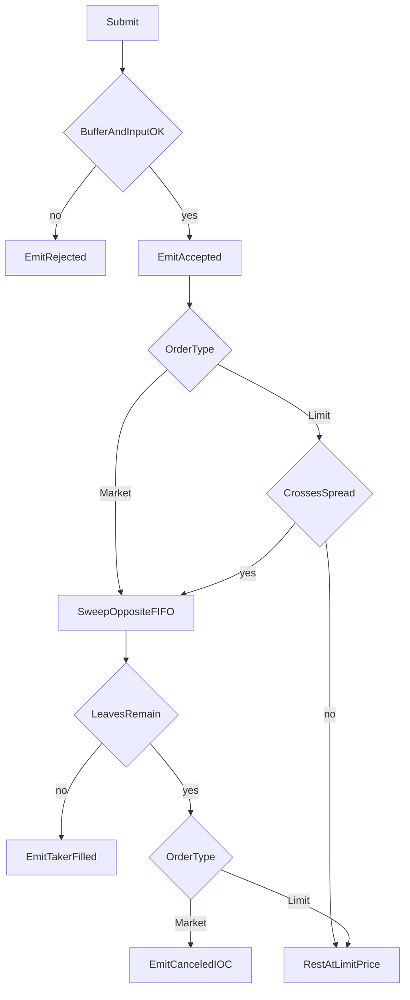

# Ultra-Low Latency L2 Order Book & Matching Engine

Status: Draft  
Language: Go (standard library only)  
Scope: in-memory Price-Time Priority matching core, benchmarks, and deterministic checks

This document is the implementation contract. Phase 1 can be built from this file alone. The engine does not take external libraries, a web server, or a database.

---

## 1. Overview & Goals

### 1.1 Purpose

Build the core of an exchange book: an **L2 order book** and a **matching engine**, entirely in memory. Match priority is **Price-Time Priority (FIFO)**.

- A better price matches first. Bids prefer a higher price. Asks prefer a lower price.
- At the same price, the order that rested earlier matches first.
- The trade price is always the **maker** price (the resting order).

This repository is a core-engineering project for nanosecond latency and allocation removal.

### 1.2 Engineering Goals

| Goal | Bar |
| --- | --- |
| Throughput | Process a prebuilt script of 1,000,000 operations on one thread and report orders per second. |
| Latency | Mean comes from `ns/op` in `go test -bench`. P99 comes from a fixed-bucket histogram inside the module. |
| Allocation | The Phase 4 hot path targets `0 allocs/op`. |
| Determinism | The same input sequence produces the same event sequence. |

The hot path is validation, crossing, resting the remainder, cancel, and size-down amend of one order. A heap allocation, lock, channel send, or `interface` dispatch on that path misses the Phase 4 bar.

### 1.3 Design in One Sentence

A single-threaded matching core keeps prices in an intrusive red-black tree and time order in a doubly linked list, then writes fills into a caller buffer through an array-backed free list and a preallocated index.

---

## 2. Design Principles

1. **Single-threaded core.** One goroutine mutates an `OrderBook`. The engine contains no mutex. Concurrent producers serialize outside the engine.
2. **Integer ticks.** Price and quantity are `int64`. The core does not compare or store floating-point prices. Tick-size conversion belongs to the caller.
3. **Caller clock.** Timestamps are `int64` nanoseconds supplied by the caller. The engine does not call `time.Now`. FIFO is the **order of successful rests**, which is independent of sorting by timestamp. Equal timestamps keep call order.
4. **Intrusive structures.** List nodes and tree nodes are not separate allocations. Link fields live inside `Order` and `LimitLevel`.
5. **No hot-path allocation.** `make`, string concatenation, `fmt`, growth of a builtin `map`, and `append` that grows a slice stay off the match loop. A short buffer returns an error before any state change.
6. **Homogeneous events.** Trades and order state leave as one slice of `Event` values. The engine does not build a slice of interfaces.
7. **Standard library only.** The module depends on the Go toolchain alone.

---

## 3. Data Structures

### 3.1 Shared Enumerations

```go
type Side uint8

const (
    SideBuy  Side = 1
    SideSell Side = 2
)

type OrderType uint8

const (
    TypeLimit  OrderType = 1
    TypeMarket OrderType = 2
)
```

`OrderID` 0 means an empty index slot, so it is not a valid order id. Order ids start at 1.

### 3.2 Order

```go
type Order struct {
    ID        uint64
    Side      uint8
    Type      uint8
    Price     int64
    Qty       int64
    Leaves    int64
    Timestamp int64
    Prev      *Order
    Next      *Order
    Level     *LimitLevel
    Slot      uint32
}
```

| Field | Meaning |
| --- | --- |
| `ID` | Caller-assigned order id. Unique inside the book. |
| `Side` | `SideBuy` or `SideSell`. |
| `Type` | `TypeLimit` or `TypeMarket`. A resting order is always a limit. |
| `Price` | Limit tick. Zero on a market order, and never used as a trade price. |
| `Qty` | Original quantity. An amend does not rewrite this field. |
| `Leaves` | Unmatched remainder. Level size and fill math use this field. |
| `Timestamp` | Caller nanoseconds. Copied onto trade events as given. |
| `Prev`, `Next` | FIFO links inside one `LimitLevel`. |
| `Level` | Price level that holds this order. Nil before the order rests. |
| `Slot` | Index into the `OrderPool` array. Used when the order returns to the pool. |

An order sits in at most one level list. Orders reached through `Prev` and `Next` share that `Level`.

### 3.3 LimitLevel

One struct holds the total size at a price, the FIFO queue, and the price-tree links.

```go
type LimitLevel struct {
    Price    int64
    TotalQty int64
    Head     *Order
    Tail     *Order
    Count    int32
    Left     *LimitLevel
    Right    *LimitLevel
    Parent   *LimitLevel
    Color    uint8 // 0 = black, 1 = red
    Slot     uint32
}
```

- `TotalQty` equals the sum of `Leaves` of every order linked at that level.
- `Count` equals the number of linked orders.
- `Head` is the oldest order at that price. `Tail` is the newest.
- An empty queue has `Head == nil`, `Tail == nil`, `Count == 0`, and `TotalQty == 0`. The level then leaves the tree and returns to the pool.

Every list operation is O(1).

- `PushBack` appends at the tail. On an empty queue, head and tail both point at the order.
- `Unlink` rewires `Prev` and `Next` and updates head or tail when needed. Canceling an order in the middle is O(1).
- `PopFront` detaches head when a maker is fully filled.

### 3.4 Price Tree

One bid tree and one ask tree. Both are red-black trees ordered by ascending price.

- The node key is `LimitLevel.Price`. A price is unique inside one tree.
- `BestBid` is the maximum price in the bid tree (the rightmost node).
- `BestAsk` is the minimum price in the ask tree (the leftmost node).
- `OrderBook` caches the `BestBid` and `BestAsk` pointers.
- Insert and delete are O(log N). N is the number of price levels on that side.
- Refreshing the cache is O(1) while the best level stays. Deleting the best level finds the successor best node in O(log N).
- Rotations rewrite pointers only. A rotation does not allocate.

Debug checks assert the red-black invariants. The implementation follows the standard CLRS rules. Color is one `uint8` field.

### 3.5 OrderBook

```go
type OrderBook struct {
    Bids         *LimitLevel
    Asks         *LimitLevel
    BestBid      *LimitLevel
    BestAsk      *LimitLevel
    Orders       OrderIndex
    OrderPool    OrderPool
    LevelPool    LevelPool
    NextTradeID  uint64
    RestingCount int32
}
```

| Field | Role |
| --- | --- |
| `Bids`, `Asks` | Roots of the bid and ask red-black trees. |
| `BestBid`, `BestAsk` | Cached best levels. Nil when that side is empty. |
| `Orders` | `OrderID → pool slot` index. Contains resting orders only. |
| `OrderPool`, `LevelPool` | Array-backed free lists. |
| `NextTradeID` | Next trade id. Starts at 1 and increases by 1 per trade. |
| `RestingCount` | Number of live resting orders. Used by the event-buffer precheck. |

`Depth` walks from the best node, toward lower prices on bids (predecessor) and higher prices on asks (successor), and fills at most `n` levels into the caller buffer. A depth query does not mutate the book.

### 3.6 Complexity

| Operation | Complexity | Notes |
| --- | --- | --- |
| Read best bid or ask | O(1) | Cached pointer |
| Rest a limit | O(log N) | Find or insert the price level. Push onto an existing level is O(1) |
| One fill at the best level | O(1) | Updates head and quantities |
| Cancel | O(1) plus conditional O(log N) | Index lookup and unlink are O(1). Deleting the last order at a price is O(log N) |
| Size-down amend | O(1) | Time priority stays |
| Price change or size-up amend | Cancel plus rest | Loses priority and takes the new timestamp |
| Depth of `n` | O(n) | Written into the caller buffer |

### 3.7 Cache Lines

Phases 1–3 keep the field order above and add no padding. Fields that the match loop reads together (`Price`, `Leaves`, `Prev`, `Next`, `Head`, `Tail`, `TotalQty`) sit at the front of the struct.

Phase 4 reviews 64-byte alignment. On a single-threaded core, blanket padding spends cache, so padding is added only in these cases:

- Hot fields of `Order` or `LimitLevel` split across two cache lines and the match loop touches both lines on every fill. Pack those hot fields onto one line.
- A later thread outside the engine shares a cache line between the event-ring write index and engine state. Separate that index.

Padding stays only when `benchmem` and the histogram show a gain.

---

## 4. Memory Strategy

### 4.1 Primary Strategy: Array-Backed Free List

`sync.Pool` can be cleared by the garbage collector, so latency jitters. It remains a comparison arm in benchmarks. The engine's default pool is an array free list.

Initialization allocates the `Order` array and the `LimitLevel` array once. Free slots are a `uint32` stack. `Get` pops an index and returns a pointer to that slot. `Put` zeroes the slot and pushes the index. Neither call allocates on the heap.

```go
type OrderPool struct {
    slots []Order
    free  []uint32
    top   int32
}

func NewOrderPool(n int) *OrderPool
func (p *OrderPool) Get() (*Order, bool)
func (p *OrderPool) Put(o *Order)
```

`LevelPool` has the same shape. A false `bool` from `Get` means the pool is empty. The hot path does not grow it with `make`.

Pool capacity is fixed for the process lifetime. Benchmarks and tests size the pools at or above the script's maximum resting orders and maximum distinct prices.

`Get` records `Order.Slot` and `LimitLevel.Slot`. `Put` reads the slot number from the pointer and returns it.

### 4.2 Pool Exhaustion

- If an order must rest and `OrderPool` is empty, fills already recorded stay, and the remainder is canceled with `ReasonPoolExhausted`.
- If a new price level is required and `LevelPool` is empty, the same rule applies. Joining an existing price level needs no level allocation.
- An order that ends in fills alone (a full fill, or any market order) never takes a resting slot.
- Tests must be able to reproduce pool exhaustion. Benchmark scripts use a capacity that does not exhaust.

### 4.3 OrderID Index

Cancel and amend look up an id in average O(1).

**Phase 1–3 baseline.** `map[uint64]*Order` is allowed so the match rules can be proven early. That map can allocate on insert, so its numbers are not the Phase 4 target. Benchmark tables label this arm `baseline-map`.

**Phase 4 target.** Replace it with an open-addressing table.

```go
type OrderIndex struct {
    keys  []uint64
    slots []uint32
    used  int32
    mask  uint32
}

func (x *OrderIndex) Lookup(id uint64) (*Order, bool)
func (x *OrderIndex) Insert(id uint64, slot uint32) bool
func (x *OrderIndex) Delete(id uint64)
```

- Table length is a power of two and is allocated once at init.
- Key 0 means an empty cell, so order id 0 is rejected.
- Delete either leaves a tombstone or uses backward-shift deletion so a linear probe chain stays intact. Pick one and lock delete-then-lookup and delete-then-reinsert with tests.
- When load would pass 0.7, `Insert` returns false and does not rehash. Rehashing allocates, so it stays off the hot path. A refused insert cancels the remainder the same way as `ReasonPoolExhausted`.
- The hash is an allocation-free integer mix, such as a multiplicative hash.
- If a benchmark uses contiguous ids from 1, the same package may offer a direct slot table (`[]uint32` of length max ID + 1). `Lookup`, `Insert`, and `Delete` keep the same observable behavior.

The index holds **resting orders only**. A fully filled taker, a market order, and a rejected order are absent from the index.

### 4.4 Event Buffer

Match functions do not allocate an event slice. They write into the spare capacity of the caller `dst` and return that same slice header.

```go
func MaxEventsFor(resting int32) int {
    return int(2*resting + 4)
}
```

`Submit`, `Cancel`, and `Amend` check `cap(dst)-len(dst) >= MaxEventsFor(book.RestingCount)` before mutating. A short buffer returns `ErrBufferFull` and leaves the book unchanged.

One order emits at most two events per maker fill (the trade plus the maker status) and a few taker status events. `2*resting+4` is that ceiling. Benchmarks preallocate `dst` to the per-op ceiling or to the sum across the script. The timed loop rewinds `len` and keeps `cap`.

---

## 5. Matching Logic

### 5.1 Events

Output is one array of events. A trade uses the same struct.

```go
type EventKind uint8

const (
    EventAccepted        EventKind = 1
    EventPartiallyFilled EventKind = 2
    EventFilled          EventKind = 3
    EventCanceled        EventKind = 4
    EventRejected        EventKind = 5
    EventAmended         EventKind = 6
    EventTrade           EventKind = 7
)

type Reason uint8

const (
    ReasonNone          Reason = 0
    ReasonBadQty        Reason = 1
    ReasonBadPrice      Reason = 2
    ReasonDuplicateID   Reason = 3
    ReasonNotFound      Reason = 4
    ReasonPoolExhausted Reason = 5
    ReasonIOCRemainder  Reason = 6
    ReasonBufferFull    Reason = 7
    ReasonBadType       Reason = 8
)

type Event struct {
    Kind      EventKind
    Reason    Reason
    OrderID   uint64
    MatchID   uint64
    TradeID   uint64
    Price     int64
    Qty       int64
    Leaves    int64
    Timestamp int64
}
```

| Kind | Field meaning |
| --- | --- |
| `EventTrade` | `OrderID` = taker, `MatchID` = maker, `Price` = maker price, `Qty` = this fill quantity, `TradeID` = `NextTradeID` |
| `EventAccepted` | The order passed validation and entered the engine. `Leaves` is the quantity at entry (`Qty`) |
| `EventPartiallyFilled` | `Qty` is this fill quantity. `Leaves` is the remainder after the fill |
| `EventFilled` | `Leaves == 0`. `Qty` is this fill quantity |
| `EventCanceled` | `Leaves` is the quantity being canceled. `Qty` equals that remainder |
| `EventRejected` | Rejected before the book changes. `Reason` holds the cause |
| `EventAmended` | Size decreased. `Qty` is `Leaves` after the decrease. `Price` is the unchanged price |

### 5.2 Lifecycle



### 5.3 Input Validation

Any of the following emits `EventRejected` and stops. The pools and trees stay as they were.

- `Qty <= 0` → `ReasonBadQty`
- Limit with `Price <= 0` → `ReasonBadPrice`
- `ID == 0`, or the index already holds that id → `ReasonDuplicateID`
- `Side` is neither buy nor sell, or `Type` is neither limit nor market → `ReasonBadType`

A short buffer may have no room for a rejection event, so the call adds nothing and returns `ErrBufferFull`.

### 5.4 Limit Entry and Crossing

After validation, write `EventAccepted` first, then test the spread.

- A buy limit crosses when `BestAsk != nil && BestAsk.Price <= order.Price`.
- A sell limit crosses when `BestBid != nil && BestBid.Price >= order.Price`.

A non-crossing limit goes to the rest step in 5.6. A crossing order fills FIFO from `Head` of the opposite best level.

One fill step:

1. `maker = level.Head`
2. `fill = min(taker.Leaves, maker.Leaves)`
3. Subtract `fill` from both `Leaves` fields and from the level `TotalQty`.
4. Record `TradeID = NextTradeID`, then add 1 to `NextTradeID`.
5. Write `EventTrade`. The price is `maker.Price`.
6. When maker `Leaves == 0`, unlink the maker, delete it from the index, return it to the pool, decrement `RestingCount`, and write `EventFilled`. When level `Count` hits 0, delete the level from its tree, refresh `BestBid` or `BestAsk`, and return the level to the pool.
7. When the maker still has size, leave it at head and write `EventPartiallyFilled`.
8. When taker `Leaves` hits 0, write taker `EventFilled` and stop. The taker receives neither an index entry nor a pool slot.
9. When the taker still has size and the next level still crosses, repeat from that level's `Head`.

A limit taker does not trade through its own price. A buy taker continues while `BestAsk.Price <= taker.Price`. A sell taker continues while `BestBid.Price >= taker.Price`.

Across levels, the better maker price is exhausted first. Inside a level, matching starts at head.

### 5.5 Partial Fill and Full Fill

- A maker that loses only part of its size keeps time priority. Head remains, with a smaller `Leaves`.
- A fully filled maker makes the next order at that price the new head.
- A fully filled taker does not rest.
- A limit taker that fills in part and still has size rests through 5.6, and the taker receives one `EventPartiallyFilled`. `Qty` on that event is the **last fill quantity**, which is distinct from the cumulative fill. Cumulative fill is `Qty - Leaves`. Each fill is already an `EventTrade`.
- Writing a taker partial on every trade can blow the event ceiling. The taker `EventPartiallyFilled` is written **once, just before rest**. The maker receives a status event on every fill.

Example. On an empty book the following inputs produce a fixed event sequence.

| Step | Input | Book afterward |
| --- | --- | --- |
| 1 | Buy Limit ID=1 Price=100 Qty=5 ts=1 | Bid 100 × 5 (order 1) |
| 2 | Buy Limit ID=2 Price=100 Qty=3 ts=2 | Bid 100 × 8, queue is 1 → 2 |
| 3 | Sell Limit ID=3 Price=100 Qty=6 ts=3 | Bid 100 × 2 (order 2 has leaves 2) |
| 4 | Sell Market ID=4 Qty=5 ts=4 | Book empty. Order 4's leftover 3 is an IOC cancel |

Fills for order 3:

- Trade 1: taker 3, maker 1, price 100, qty 5. Order 1 `Filled`.
- Trade 2: taker 3, maker 2, price 100, qty 1. Order 2 `PartiallyFilled`, leaves 2.
- Order 3 `Filled`.

Fills for order 4:

- Trade 3: taker 4, maker 2, price 100, qty 2. Order 2 `Filled`.
- Order 4 `Canceled`, reason `ReasonIOCRemainder`, leaves 3.

This sequence is the first golden case under `test/fixtures`.

### 5.6 Resting the Remainder

A limit remainder greater than zero joins that side's tree.

1. If the price level exists, append the order at its tail.
2. Otherwise take a level from `LevelPool`, set the price, insert it into the tree, and attach the order as the first order at that level.
3. Copy order fields into the pool slot. The engine does not retain the caller's memory.
4. If the index refuses the slot or the pool is empty, fills already recorded stay and the remainder is canceled with `ReasonPoolExhausted`.
5. On success, add 1 to `RestingCount` and add `Leaves` to `TotalQty`.
6. If the new price is the best price, point `BestBid` or `BestAsk` at that level.

Market orders never reach this step.

### 5.7 Cancel

```text
Cancel(id):
  if buffer too small: return ErrBufferFull, book unchanged
  order = index.Lookup(id)
  if not found: return ErrNotFound, book unchanged
  unlink order from order.Level
  level.TotalQty -= order.Leaves
  level.Count -= 1
  if level.Count == 0:
      delete level from its tree
      refresh BestBid or BestAsk
      levelPool.Put(level)
  index.Delete(id)
  restingCount -= 1
  emit EventCanceled, reason ReasonNone, qty = leaves
  orderPool.Put(order)
```

An unknown id returns `ErrNotFound` and changes nothing. An order already fully filled, and therefore absent from the index, takes the same path.

Unlink is O(1) at any queue position. The tree cost appears only when the canceled order is the last order at that price.

### 5.8 Amend

```go
func (b *OrderBook) Amend(id uint64, newPrice, newQty, ts int64, dst []Event) ([]Event, error)
```

The target is a resting limit present in the index. A missing id returns `ErrNotFound` and leaves the book unchanged.

**Size decrease only** (`newPrice == order.Price` and `0 < newQty < order.Leaves`):

1. `delta = order.Leaves - newQty`
2. `order.Leaves = newQty`
3. `level.TotalQty -= delta`
4. Write `EventAmended`. Store `ts` on the order and **keep the queue position**.
5. The list order stays. The operation is O(1).

`newQty == 0` is `Cancel(id)`.

**Price change, or a new quantity above the current remainder:**

Before any mutation, require `cap(dst)-len(dst) >= MaxEventsFor(book.RestingCount)+1`. That reserves one cancel event plus the ceiling `Submit` needs after the cancel. A shortfall returns `ErrBufferFull` and leaves the book unchanged.

1. Cancel the existing order through 5.7. The cancel reason is `ReasonNone`.
2. `Submit` a new limit with the same id, quantity `newQty`, price `newPrice`, and timestamp `ts`.
3. The new order joins the tail of that price, or a new level, and loses time priority.
4. If cancel succeeds and the new `Submit` is rejected, the cancel stands. The caller sees the rejection event. Tests lock this order in a golden file.

A size increase loses priority because the extra size would jump ahead of orders already waiting, which breaks FIFO.

`newQty < 0`, or a limit price at or below 0, returns `ErrBadAmend` and leaves the book unchanged. The call does not emit `EventRejected`, so a live order is not paired with a rejection event.

### 5.9 Market Orders and Unmatched Remainder

Market orders are IOC.

1. Write `EventAccepted`.
2. While the opposite book has size and taker `Leaves > 0`, repeat the fill step from 5.4. A market order has no price limit.
3. Stop when the opposite book is empty or no more size can match.
4. Taker `Leaves == 0` produces `EventFilled`.
5. A positive taker remainder produces `EventCanceled` with `ReasonIOCRemainder`. That size does not rest.
6. An empty opposite book at entry cancels the whole quantity with `ReasonIOCRemainder` and produces no trade.

The market `Price` field is ignored. Each trade price is that maker's price.

### 5.10 Fill Invariants

After one `Submit` returns, the following hold.

- The sum of recorded `EventTrade.Qty` equals the taker's `Qty` minus its final `Leaves`. IOC cancel quantity is outside that sum.
- Each trade price is that maker's resting price.
- For a limit taker, no trade price is worse than the taker price. A buy trade price is `<=` the limit. A sell trade price is `>=` the limit.
- If the taker remains on the book, it no longer crosses the opposite best price.

---

## 6. Invariants

The test helper `CheckInvariants` runs at the end of each scenario.

1. Each level's `TotalQty` equals the sum of `Leaves` in its queue. `Count` equals the list length.
2. `Head.Prev == nil` and `Tail.Next == nil`. Interior `Prev` and `Next` point at each other.
3. Every queued order's `Level` is that level, its `Side` matches the tree, and its `Type` is limit.
4. One order pointer appears in one level only.
5. `BestBid` is the maximum bid price and `BestAsk` is the minimum ask price. An empty tree has a nil pointer.
6. `BestBid.Price < BestAsk.Price`, or one side is empty. A call does not return with a crossed book.
7. Index entries are exactly the resting orders. `RestingCount` equals that count.
8. A canceled or fully filled order is absent from the index, from every list, and from the in-use set of the pool.
9. `top` plus the number of in-use slots equals the pool capacity.
10. `NextTradeID` equals the number of `EventTrade` events so far, plus 1.

---

## 7. Directory Layout

The tree holds the core, pools, index, event contract, benchmarks, and golden files. It has no web server package and no database package.

```text
toy-exchange/
  SPEC.md
  go.mod
  cmd/replay/                 Phase 5 replay entrypoint
  internal/engine/            Order, LimitLevel, tree, OrderBook, Match
    book.go
    match.go
    level.go
    tree.go
    invariant.go
    book_test.go
    match_test.go
    match_ref_test.go         Slow reference matcher. Test binary only
    bench_test.go
  internal/pool/              OrderPool, LevelPool
    freelist.go
    freelist_test.go
  internal/index/             OrderIndex
    index.go
    index_test.go
  pkg/events/                 Event, EventKind, Reason (external contract)
    event.go
  test/fixtures/              Deterministic scenario golden files
    basic_fifo.txt
    basic_fifo.out.txt
```

- `internal` tests live beside the package as `*_test.go`.
- `test/fixtures` holds inputs and expected outputs only.
- `pkg/events` publishes the event definitions so a replayer and a bench driver can consume them without importing engine internals.
- The reference matcher lives only in `match_ref_test.go` with `package engine`. Production sources do not compile that file.

Phase 5's parser and stream reader live in `cmd/replay` and `internal/replay`. The matching package does not import those packages.

---

## 8. API Sketch

Signatures are fixed here. The algorithms are in section 5.

```go
func New(orderCap, levelCap, indexCap int) (*OrderBook, error)

func (b *OrderBook) Submit(in OrderInput, dst []Event) ([]Event, error)
func (b *OrderBook) Cancel(id uint64, dst []Event) ([]Event, error)
func (b *OrderBook) Amend(id uint64, newPrice, newQty, ts int64, dst []Event) ([]Event, error)

func (b *OrderBook) BestBid() (price, qty int64, ok bool)
func (b *OrderBook) BestAsk() (price, qty int64, ok bool)
func (b *OrderBook) Depth(side Side, n int, dst []LevelView) []LevelView

type OrderInput struct {
    ID        uint64
    Side      Side
    Type      OrderType
    Price     int64
    Qty       int64
    Timestamp int64
}

type LevelView struct {
    Price int64
    Qty   int64
    Count int32
}
```

`Submit` takes `OrderInput` by value. It copies into a pool slot only when the order rests. The caller's stack copy is independent of the engine lifetime.

Errors are reserved for precondition failures that leave state unchanged.

| Error | When |
| --- | --- |
| `ErrBufferFull` | Spare `dst` capacity is below `MaxEventsFor` |
| `ErrNotFound` | Cancel or amend id is absent from the index |
| `ErrBadAmend` | Amend quantity or price breaks the amend rules |

A validation reject (quantity, price, duplicate id, or type) returns `error == nil` and appends `EventRejected` to `dst`. The caller reads the event.

`Depth` treats `len(dst)` as 0 and fills `min(n, cap(dst))` entries. A short buffer returns what fits and does not allocate.

---

## 9. Step-by-Step Implementation Roadmap

A later phase does not land its optimizations before the previous phase's exit checks pass. Phase 4 starts after the Phase 3 numbers are recorded.

### Phase 1 — Core Structures and Unit Tests

Deliverables: `internal/pool`, plus `Order`, the intrusive list, and `LimitLevel` in `internal/engine`, with tests.

Exit checks:

- Tests lock an empty queue, a single order, push order, unlink in the middle, and removal of head and tail.
- After unlink, `TotalQty` and `Count` match the queue.
- Repeating pool `Get` and `Put` up to capacity adds no allocations (a `testing` allocation check, or a freelist benchmark).
- Red-black insert, delete, maximum, and minimum match small deterministic cases.

This phase does not implement matching.

### Phase 2 — OrderBook and the Match Loop

Deliverables: the book wired to the trees, `Submit`, `Cancel`, `Amend`, `Depth`, the section 5 event order, `CheckInvariants`, and the reference matcher.

Exit checks:

- The FIFO example in 5.5 matches event for event.
- A limit walks several price levels, and any remainder rests at its own price.
- A market remainder does not rest and ends with `ReasonIOCRemainder`.
- A size-down amend keeps queue order. A price-change amend joins the tail of the new price.
- Cancel of an unknown id returns `ErrNotFound` and preserves invariants.
- The reference matcher emits the same event log.

The Phase 2 index may be the baseline map.

### Phase 3 — Baseline Benchmark

Deliverables: `internal/engine/bench_test.go`, the script generator from 10.1, and a written measurement (commit message or the text result in `test/fixtures/bench_baseline.txt`).

Command:

```text
go test -bench=. -benchmem -count=10 ./internal/...
```

Exit checks:

- Setup outside the timer and the hot path inside the timer are separate in the code.
- The 1,000,000-op script reports ns/op, B/op, allocs/op, and orders/sec on one line.
- Phase 3 is complete even when the baseline map shows allocs/op above 0. Record the number.

### Phase 4 — Zero-allocation

Deliverables: free list on the default path, open-addressing `OrderIndex` (or a direct table for contiguous ids), cache-line alignment only where section 3.7 allows it, and a rerun of the same benchmark.

Exit checks:

- The 10.1 benchmark reports allocs/op of 0 and B/op of 0.
- Behavioral tests and golden files match Phases 2 and 3. The optimization preserves event order.
- Pool exhaustion and index refusal stay under test.
- If a `sync.Pool` comparison arm exists, the result table lists `pool-sync` and `pool-freelist`. The default build uses the free list.

### Phase 5 — Binance L2 Replay (extension)

Deliverables: `internal/replay` and `cmd/replay`. Compile dependencies point from the replayer toward the core, never the other way.

This phase does the following:

- Parse public Binance diff-depth fields (snapshot and incremental price/quantity fields such as `U`, `u`, `b`, and `a`).
- Apply increments on top of a snapshot and rebuild a local L2 book (price → quantity).
- Replay a capture file, or a byte slice already in memory, in order.

This phase leaves the following outside the engine:

- Order placement, account signing, and trading endpoints.
- Sharing parser allocations with the match hot path. JSON parse allocations stay in the replay process. Input reaches the core only after it has been turned into an `OrderInput` array.

The connection has two stages.

1. **Book rebuild.** Apply exchange quantities onto a local map on the replay side and check depth.
2. **Optional script synthesis.** Turn the difference between two successive books into synthetic limits and cancels that can feed a golden replay of the matching engine. The synthesis rules are fixed by tests in `internal/replay`, not by code comments. The engine is not called until synthesis has finished.

Even if a websocket reader appears, `internal/engine` does not import `net`.

---

## 10. Benchmark & Verification

### 10.1 Scenario

The script is built before the timer starts. The benchmark loop only reads the script and calls `Submit`, `Cancel`, or `Amend`.

| Item | Value |
| --- | --- |
| Length | 1_000_000 ops |
| Mix | 70% limit, 20% cancel, 10% market |
| Seed | Fixed `uint64` value `1`. The generator is xorshift64 or an equivalent integer generator. |
| Mid price | 10_000 ticks |
| Buy limit prices | Uniform integer `[mid-16, mid]` |
| Sell limit prices | Uniform integer `[mid, mid+16]` |
| Quantity | Uniform integer `[1, 10]` |
| IDs | Increasing from 1. A cancel picks uniformly from ids issued so far, including ids that are already gone. |
| Timestamp | Equal to the op index. Pick a start of 0 or 1 and keep it for the whole script. |
| Pool capacity | Order slots ≥ 1_000_000 and level slots ≥ 64, so rests succeed. The price span is 33 ticks, so 64 level slots cover both sides. |

The 20% cancel mix includes ids that were already filled or canceled. `ErrNotFound` is the correct result there. The same script fails at the same positions.

Throughput:

```text
orders/sec = 1_000_000 / elapsed_seconds
```

`elapsed` is the benchmark's ns/op multiplied by the op count, converted to seconds.

Report ns/op, B/op, allocs/op, orders/sec, and P99.

### 10.2 P99

The default Go benchmark reports a mean. P99 replays the same 1,000,000 ops once more and drops each op's elapsed nanoseconds into a fixed bucket.

- Bucket edges are powers of two in nanoseconds (1, 2, 4, …, 2^20) plus one overflow bucket above that.
- The histogram array is allocated before the run.
- P99 is the upper edge of the first bucket whose cumulative count reaches 99% of the sample.
- The histogram lives in this module and uses no external library.

Publish the bucket upper edge next to the P99 number. The coarse bucket stays visible in the result.

### 10.3 Determinism

1. **Golden files.** Compare the event log of a fixed script (at least the 5.5 example, plus the first 1_000 ops of seed `1`) byte for byte with `test/fixtures/*.out.txt`.
2. **Reference matcher.** A slow matcher built from slices and sorting consumes the same `OrderInput` sequence and emits the same log. The reference matcher may allocate. Compare it with production `Submit` in tests only.
3. **Invariants.** Call `CheckInvariants` after every op in golden cases and in random-seed cases. Do not call it inside the 1_000_000-op benchmark loop.
4. **Log format.** One event per line, fields separated by spaces, integers in base 10.

```text
TRADE tradeID takerID makerID price qty timestamp
ACCEPTED orderID leaves timestamp
PARTIAL orderID qty leaves timestamp
FILLED orderID qty timestamp
CANCELED orderID leaves reason timestamp
REJECTED orderID reason timestamp
AMENDED orderID price leaves timestamp
```

`reason` is the integer value of `Reason`. Golden files match this UTF-8 text, with `\n` line endings.

### 10.4 Performance Regression

A pull request that changes the hot path after Phase 4 checks that allocs/op stays 0 under the same seed and the same command. Compare ns/op by the median of `-count=10`.

---

## 11. Explicit Non-Goals

The following sit outside the engine API. A later layer may wrap `Submit`; it does not enter the engine.

- Authentication, accounts, balances, and margin
- Fees and fee currency
- Self-trade prevention. If the same party submits both sides, they match under the price-time rules in this spec
- A network server, persistence, and snapshot recovery
- Several goroutines mutating one `OrderBook`
- Stop orders, iceberg orders, and FOK. The market remainder policy is IOC
- Floating-point quotes, currency conversion, and tick-table lookup

---

## 12. Package Boundary Summary

| Package | May know | Stays unaware of |
| --- | --- | --- |
| `pkg/events` | Event values | Trees and pools |
| `internal/engine` | Matching, trees, pools, and the index | `net`, JSON, and exchange messages |
| `internal/pool`, `internal/index` | Slots and keys | Match rules |
| `internal/replay`, `cmd/replay` | Binance L2 messages and the engine API | Retaining interior engine pointers |

The moment the engine imports a replay format, Phase 5 has crossed into the core.
